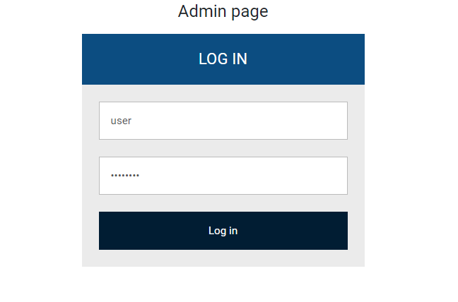
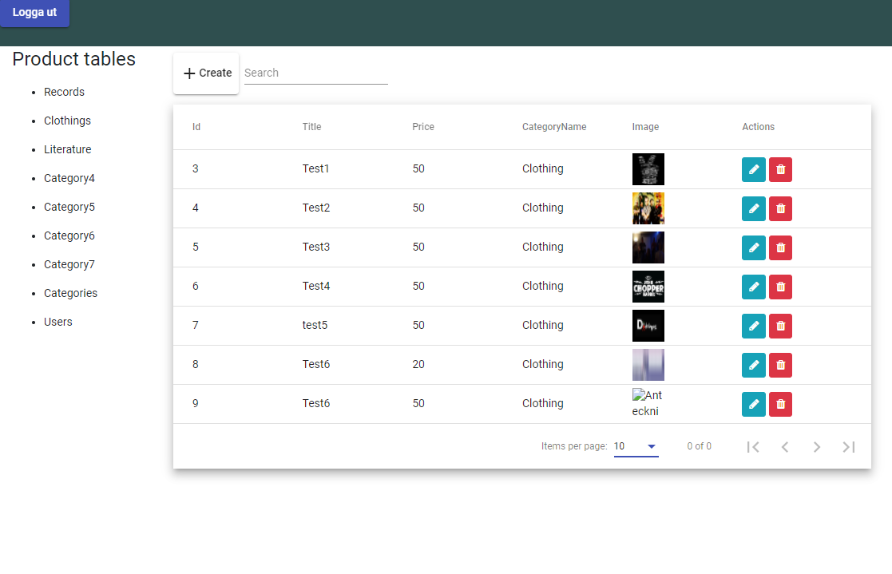
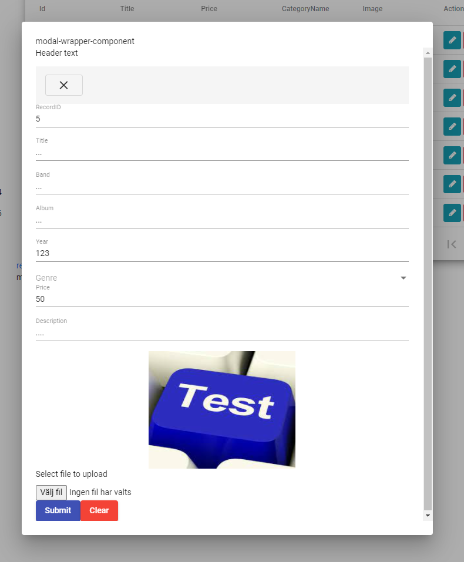

# WebShop
Work in progress...

<b>Backend:</b>
<ul>
  <li><em>UserApi</em>: REST api with a user database generated via the Identity package from ASP.NET Core (you can of course set up your own database, but Identity configures the entire user management both in the database and in the api). Azure key vault integration for safe database connection</li>
  <li><em>WebApi</em>: REST api where the handling for the products is managed. As examples of products (Enteties) I have added Reckord, Clothes, Shoes and Others. To structure the products, each item is tagged with a category ID. Hence there is a category-entety and a sub-category-entity. Azure key vault integration for safe database connection</li>
</ul>

<b>Frontend:</b>
<ul>
  <li><em>WebShopAdmin</em>: Admin where a logged in administrator can add, delete and update products as well as add new categories.</li>
  <li><em>WebShopSite</em>: The page that presents all products, a user should be able to add products to their shopping cart and place an order</li>
</ul>

Site:
 

Admin:

(Log in page)

(Database content i tables)

(modal to edit table item)

## Development server

Run `ng serve` for a dev server. Navigate to `http://localhost:4200/`. The app will automatically reload if you change any of the source files.

